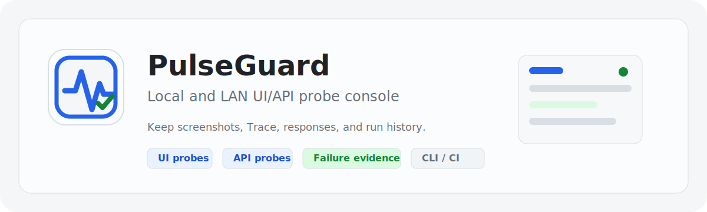

# PulseGuard

[简体中文](./README.md) | [English](./README.en.md)

<p align="center">
  
</p>

PulseGuard is a small UI/API probe console for local and LAN environments. It helps teams continuously check internal admin pages, login prerequisites, health endpoints, batch-process heartbeats, certificates, and basic network reachability. Run history, failure evidence, alert policies, and read-only status are managed in one single-instance console.

PulseGuard is not a SaaS product, public status page, full E2E test management platform, or incident/on-call system. Its current boundary is single-instance local or LAN usage with SQLite as the default persistence layer.

## Core Capabilities

- UI/API probe tasks: scheduled runs, manual runs, draft debugging, structured assertions, and advanced Python scripts.
- UI setup scripts: scan, draft debug, and formal runs all execute `setup_script` first to prepare login state, page prerequisites, and business context.
- Rule maintenance: UI selector stability hints, rule invalidation checks, API response field preview, and one-click basic assertion generation.
- Batch operations: run, enable, disable, and reschedule tasks by type, tag, and enabled state, with matched counts to prevent accidental bulk actions.
- Run history: status, duration, error summary, screenshots, Trace, Response Body, recent-success comparison, and failure summary.
- Runner tracking: local Runner name, address, network zone, browser version, Runner heartbeat, and Runner status list.
- Failure attribution: separates target failures from Runner execution environment failures.
- Alert policies: global, tag-level, and task-level alert policies with cooldown, recovery notification, and notification channel controls.
- Operations audit: records task changes, settings changes, batch operations, config import, and version restoration.
- Task versions: stores task definition snapshots and supports viewing and restoring historical versions.
- Internal status page: shows sanitized task status, recent incidents, run metrics, and maintenance announcements.
- Read-only outputs: read-only snapshot, JSON metrics, and Prometheus metrics.
- Config transfer: export, sanitized export, import preview, and import apply. Config JSON can be managed in Git.
- CLI/CI: run probes by task ID, type, or tag, and report pipeline results with exit codes.
- Extended probes: templates and `ctx` helpers support passive heartbeat, TLS expiration, HTTP keyword/redirect/asset checks, TCP, and DNS.

## Tech Stack

- Backend: FastAPI, SQLite, Playwright Python, `uv`
- Frontend: React, TypeScript, Vite, Ant Design
- Runtime: Docker Compose or local development processes
- Persistence: SQLite plus local `data/` and `reports/`

## Quick Start

Use Docker Compose for a complete production build:

```powershell
docker compose up --build -d
```

By default, PulseGuard is published on `0.0.0.0:8787`:

- Local access: `http://127.0.0.1:8787`
- LAN access: `http://<your LAN IP>:8787`

Common checks:

```powershell
docker compose ps
docker compose logs --tail 80 pulseguard
Invoke-WebRequest -UseBasicParsing http://127.0.0.1:8787/api/health
```

To restrict access to the local machine only, set the following in `.env`:

```env
PULSEGUARD_PUBLISH_HOST=127.0.0.1
PULSEGUARD_HOST=0.0.0.0
PULSEGUARD_PORT=8787
PULSEGUARD_PUBLISH_PORT=8787
PULSEGUARD_ALERT_DETAIL_BASE_URL=http://127.0.0.1:8787
```

## Local Development

Backend dependencies are managed with `uv`:

```powershell
uv sync
uv run python -m playwright install chromium
uv run uvicorn app.main:app --app-dir backend --host 127.0.0.1 --port 8787 --reload
```

Frontend dependencies are managed with npm:

```powershell
cd frontend
npm ci
npm run dev
```

The default frontend development URL is `http://127.0.0.1:5173`. To specify a port and backend proxy:

```powershell
cd frontend
$env:VITE_DEV_API_TARGET="http://127.0.0.1:8787"
npm run dev -- --host 127.0.0.1 --port 5175
```

## Verification

Backend:

```powershell
uv run python -m unittest discover -s backend/tests -p 'test_*.py' -v
```

Frontend:

```powershell
cd frontend
npm run build
```

Docker:

```powershell
uv lock --check
.\scripts\deploy.ps1
```

## Script Task Entry Points

Advanced scripts use a fixed entry point:

```python
async def check(ctx):
    response = await ctx.request()
    ctx.assert_status(response, 200)
```

UI tasks can use `setup_script` first to prepare page prerequisites:

```python
async def setup(ctx):
    page = await ctx.new_page()
    await page.goto(ctx.entry_url)
    return page
```

Structured UI/API assertions do not require an advanced script. Complex login, multi-window flows, or business branches can still use script mode.

## Data And Security Boundaries

- SQLite is the default persistence layer. The database file lives in `data/`.
- Screenshots, Trace files, Response Body artifacts, and archived summaries live in `reports/`.
- Environment variables, webhooks, DingTalk secrets, read-only tokens, common auth headers, and cookies are redacted in public settings, run records, read-only outputs, and the status page.
- User-defined Python probe scripts are a trusted local tool capability, not a security sandbox.
- The internal status page only shows sanitized summaries. It does not expose scripts, headers, webhooks, environment variables, response bodies, error stacks, or Runner topology.
- Recording is not the current mainline. Multi-step probes should prioritize templates, setup scripts, and structured rules.

## Common API Endpoints

- `GET /api/health`: health check
- `GET /api/status-page`: internal status page data
- `GET /api/metrics.json`: JSON metrics
- `GET /api/metrics`: Prometheus metrics
- `GET /api/read-only/snapshot`: read-only snapshot, requires a configured read-only token
- `POST /api/runners/heartbeat`: Runner heartbeat
- `POST /api/heartbeats/{key}`: passive heartbeat report

## Repository Structure

```text
backend/                 FastAPI backend, storage, runner, alerts, tests
frontend/                React frontend, pages, workflow components, design styles
data/                    SQLite data directory
reports/                 Screenshots, Trace files, Response Body artifacts, archived summaries
docs/                    Roadmap, design, and feature documents
Dockerfile               Production image build
docker-compose.yml       Single-instance deployment
pyproject.toml           Backend dependency definition
uv.lock                  Backend dependency lockfile
```

## Current Direction

The near-term goal is to make PulseGuard a stable internal probe workbench:

- Strengthen structured rules, scan candidates, failure summaries, and config transfer first.
- Keep the SQLite single-instance model unless the deployment model changes to multi-instance, multi-user, or high-volume historical analytics.
- AI-assisted rule generation and Playwright case import are future enhancements. They must redact by default and save only after user confirmation.
- Recording remains a long-term observation item and is not part of the current mainline.

## Brand Assets

PulseGuard brand assets live in `assets/brand/`:

- `pulseguard-mark.svg`: light-background project icon for favicon, app sidebar, and small-size usage.
- `pulseguard-brand-card.svg`: Chinese README and project-introduction brand card.
- `pulseguard-brand-card.en.svg`: English README and project-introduction brand card.
- `pulseguard-logo-concept.png`: light-background imagegen concept reference. The official mark is the SVG asset.

The brand uses the project design system's light panel surface, control blue, and status green. It does not use dark icon backgrounds, gradients, or glassmorphism.

## License

PulseGuard is open source under the [Apache License 2.0](./LICENSE). You may use it commercially, modify it, and redistribute it, but you must keep copyright, license, and attribution notices as required by the license.

When redistributing or publishing derivative works based on this project, keep:

- [LICENSE](./LICENSE)
- [NOTICE](./NOTICE)
- Project name `PulseGuard`
- Original repository link `https://github.com/liyanqing90/PulseGuard`
