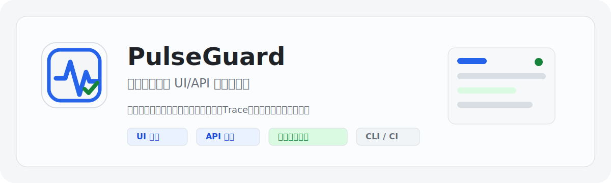

# PulseGuard

[简体中文](./README.md) | [English](./README.en.md)

<p align="center">
  
</p>

PulseGuard（脉守）是一个面向本地和局域网的小型 UI/API 探活控制台。它适合团队在内网环境里持续检查后台页面、登录前置流程、健康接口、批处理心跳、证书和基础网络可达性，并把运行历史、失败证据、告警策略和只读状态统一放在一个单实例控制台中管理。

团队标识：新零售测试团队。

PulseGuard 不是 SaaS、公开状态页、完整 E2E 测试管理平台或 incident/on-call 系统。当前边界是单实例、本地或 LAN 使用，默认 SQLite 持久化。

## 核心能力

- UI/API 探活任务：支持定时执行、手动执行、草稿调试、结构化断言和高级 Python 脚本。
- UI 前置脚本：扫描、草稿调试和正式运行都会先执行 `setup_script`，用于准备登录态、页面前提和业务上下文。
- 规则维护：支持 UI selector 稳定性提示、规则失效检测、API 响应字段预览和一键生成基础断言。
- 批量操作：按类型、标签和启用状态批量执行、启停、调频，并用命中数量防止误操作。
- 运行记录：已保存任务的定时、手动、批量和重跑均属于正式执行，会影响健康状态、成功率与告警；只有编辑器配置试运行不影响状态且不触发告警。
- 监控趋势：独立趋势页展示整体 UI/API 和分页任务趋势，按 24 小时、7 天、30 天或自定义时间段查看平均响应、P95、P99 和失败次数。
- 可信健康状态：支持健康、疑似故障、故障、疑似恢复、未知、观测陈旧、停用，Runner 异常不会误报为目标故障。
- 证据保留：失败时保存错误摘要、截图、Trace 和 Response Body；成功 API 响应默认只保留摘要。
- 执行节点打通：支持本机、手动直连子节点和 Relay 自动接入，适配无法开放入站端口的内网/跨网络节点，统一调度、健康检查和证据回传。
- 失败归因：区分被探测目标失败和 Runner 执行环境失败，便于判断是业务/断言问题还是探针环境问题。
- 告警策略：支持全局、标签级、任务级告警策略，覆盖冷却、恢复通知和通知渠道。
- 运维审计：记录任务、设置、批量操作、配置导入和版本恢复等关键操作。
- 任务版本：保存任务变更快照，支持查看和恢复历史版本。
- 只读出口：提供只读快照、JSON 指标和 Prometheus 指标。
- 配置迁移：支持配置导出、脱敏导出、导入预检和应用导入，可把配置 JSON 纳入 Git 管理。
- CLI/CI：支持按任务 ID、类型或标签运行探活，并用 exit code 表达流水线结果。
- 扩展探活：通过模板和 `ctx` helper 支持被动心跳、TLS 到期、HTTP keyword/redirect/asset、TCP、DNS 等检查。

## 近期新增与行为变更

- 品牌和健康检查会保留 PulseGuard 原名，同时展示团队标识 `新零售测试团队`。
- 监控趋势页支持整体 UI/API 卡片、分页任务卡片、详情抽屉、卡片独立观察维度，以及 24 小时、7 天、30 天、自定义时间段和每日时段筛选。
- 趋势响应时间只基于成功执行记录计算，失败和 Runner 异常不参与平均、P95、P99。
- 趋势聚合由新运行增量写入 `trend_rollups`；历史趋势回填不是启动必选项，默认不会回填旧运行。
- Relay 自动接入支持生成和重新生成子节点部署命令，worker 只需出站连接主节点 relay，不需要开放 `8788` 入站端口。
- 子节点支持上报版本、构建 SHA、当前镜像和 browser type 安装状态；启用 updater profile 后，主节点可以发起受控更新。

## 技术栈

- Backend: FastAPI, SQLite, Playwright Python, `uv`
- Frontend: React, TypeScript, Vite, Ant Design
- Runtime: Docker Compose 或本地开发进程
- Persistence: SQLite + 本地 `data/`、`reports/`

## 快速启动

推荐用 Docker Compose 运行完整生产构建：

```powershell
docker compose up --build -d
```

默认发布到 `0.0.0.0:8787`：

- 本机访问：`http://127.0.0.1:8787`
- 局域网访问：`http://<本机局域网 IP>:8787`

常用检查：

```powershell
docker compose ps
docker compose logs --tail 80 pulseguard
Invoke-WebRequest -UseBasicParsing http://127.0.0.1:8787/api/health
```

如只允许本机访问，可在 `.env` 中设置：

```env
PULSEGUARD_PUBLISH_HOST=127.0.0.1
PULSEGUARD_HOST=0.0.0.0
PULSEGUARD_PORT=8787
PULSEGUARD_PUBLISH_PORT=8787
PULSEGUARD_ALERT_DETAIL_BASE_URL=http://127.0.0.1:8787
```

## 本地开发

后端依赖使用 `uv`：

```powershell
uv sync
uv run python -m playwright install chromium
uv run uvicorn app.main:app --app-dir backend --host 127.0.0.1 --port 8787 --reload
```

前端依赖使用 npm：

```powershell
cd frontend
npm ci
npm run dev
```

前端默认开发地址是 `http://127.0.0.1:5173`。如需要指定端口和后端代理：

```powershell
cd frontend
$env:VITE_DEV_API_TARGET="http://127.0.0.1:8787"
npm run dev -- --host 127.0.0.1 --port 5175
```

## UI 浏览器生命周期

UI 任务支持 `chromium`、`firefox`、`webkit` 三类 Playwright browser type。系统设置里可以分别配置：

- `enabled_browser_types`：允许任务选择和执行的 browser type。
- `prewarmed_browser_types`：后端启动或设置变更时自动预热的 browser type，必须是已启用类型，可以多选或为空。
- `browser_pool_sizes`：每个 browser type 独立的空 `BrowserContext` 储备数量，单类默认 5。

每个预热的 browser type 会保留 1 个 Playwright browser 进程，并按该 type 的 pool size 预创建空 `BrowserContext`。UI 任务会独占租用 1 个 context/page；任务结束只关闭 context，不关闭 browser，资源池随后补齐空 context。Web 与 H5 尺寸通过 context options 区分，同一个 browser 进程下可以并发运行不同 viewport 的任务。

`browser_type` 只对 UI 任务生效。任务执行时先解析执行节点，再在每个节点内解析 browser type；节点多选和 browser type 多选会按节点 × browser type 矩阵创建运行记录。只有“已启用且该节点已安装”的 browser type 会实际执行，缺失或未启用的组合会记录为 Runner 异常。启用新的 browser type 后，主节点会请求本机和可用子节点安装对应 Playwright browser；正式执行时，主节点也会把 `enabled_browser_types`、`prewarmed_browser_types` 和 `browser_pool_sizes` 下发给子节点，子节点按同一套配置刷新资源池并预热浏览器。

## 多运行节点

PulseGuard 默认保留并启用内置 `local` 节点。子节点是独立部署的执行服务，只负责暴露受 token 保护的健康检查和执行接口、执行主节点下发的任务、回传运行结果和证据文件；子节点不会启动调度器、不会写主节点数据库，也不会发送告警。

子节点有两种接入模式：

- 手动添加：沿用原有方式。主节点必须能直接访问子节点 `http://<worker>:8788`，页面中填写地址和 worker token。
- 生成部署命令：新增 PulseGuard Relay 方式。worker 不开放入站端口，只主动出站连接主节点 relay；主节点通过 Docker 网络内的 relay 内部端口访问 worker API。

### Relay 自动接入

主节点启用 relay server：

```sh
export PULSEGUARD_RELAY_PUBLIC_HOST="<主节点公网 IP>"
docker compose -f docker-compose.yml -f docker-compose.relay.yml up --build -d
```

默认公网 relay 端口是 `9443`。如果只能开放 `443`，设置：

```sh
export PULSEGUARD_RELAY_PUBLIC_PORT=443
docker compose -f docker-compose.yml -f docker-compose.relay.yml up --build -d
```

主节点会在 `data/relay/` 下生成自签 TLS 证书，页面和 API 会显示 server fingerprint。worker 侧 relay-client 会校验 fingerprint 后才发送 relay token。已有 relay runner 时如果证书或私钥丢失，服务会拒绝静默重建证书；需要从备份恢复 `data/relay/`，否则已部署 worker 的 fingerprint pinning 会失效。

主节点数据库只保存 relay token hash；relay token 是完整隧道接入凭据，部署命令必须按敏感信息处理。worker token 因主节点调用 worker API 时必须使用，会用 `cryptography` Fernet 加密后保存到数据库。默认加密 key 文件是主节点数据目录下的 `runner-token.key`，可用 `PULSEGUARD_RUNNER_TOKEN_KEY_FILE` 指定路径，或用 `PULSEGUARD_RUNNER_TOKEN_ENCRYPTION_KEY` 注入 Fernet key。备份或迁移主节点时必须同时保管该 key，否则已有 worker token 无法解密。

Relay 控制面默认使用 Docker 内部地址 `http://pulseguard-relay-internal:18000`，只用于主节点通知 relay server 踢掉旧 session。控制 token 保存在 `data/relay/control-token`，不会写入部署命令；`18000` 只在 Docker 网络内 `expose`，不要映射到公网。重新生成命令、停用或删除 runner 时，数据库中的 token/runner 状态先立即失效；控制面 revoke 是加速旧 session 断开的内部通知，短暂不可达不会阻止数据库失效和端口 quarantine。

Docker relay overlay 会额外创建 internal-only 网络。主节点默认通过 `pulseguard-relay-internal` 访问 relay 内部端口，relay server 也默认只把 per-runner 内部 listener 绑定到这个 internal alias；如需改动，成对设置 `PULSEGUARD_RELAY_INTERNAL_HOST` 和 `PULSEGUARD_RELAY_INTERNAL_LISTEN_HOST`。

Relay 每个 worker session 的并发内部 TCP stream 上限默认跟随系统设置里的“最大并发任务数”；数据库或设置暂不可读时，才回退到 `PULSEGUARD_RELAY_MAX_CONCURRENT_STREAMS`。超出上限的 stream 会被拒绝，让主节点任务队列继续承担排队和限流。空闲 stream 默认 900 秒关闭，可用 `PULSEGUARD_RELAY_STREAM_IDLE_TIMEOUT_SECONDS` 调整。已删除 runner 的内部端口默认至少 quarantine 到 `stream idle timeout + 60s`，并且不少于 10 分钟；可用 `PULSEGUARD_RELAY_PORT_QUARANTINE_SECONDS` 延长。

同一个 runner ID 只保留一个活跃 relay session；新 session 认证成功后会替换旧 session，避免 worker 重启后被旧连接卡住。

公网 relay 入口默认限制 256 条 WebSocket 连接，worker 必须在 10 秒内发送 hello；单条 WebSocket message 默认上限 1 MiB，server 侧禁用 WebSocket 压缩，并对重复无效认证做短退避。建立 session 后如果超过 relay heartbeat 窗口没有任何消息，server 会主动关闭 session。可用 `PULSEGUARD_RELAY_MAX_PUBLIC_CONNECTIONS`、`PULSEGUARD_RELAY_HELLO_TIMEOUT_SECONDS`、`PULSEGUARD_RELAY_MAX_FRAME_BYTES`、`PULSEGUARD_RELAY_AUTH_BACKOFF_BASE_SECONDS`、`PULSEGUARD_RELAY_AUTH_BACKOFF_MAX_SECONDS` 调整。

在主节点打开“系统设置 > 执行配置 > 新增子节点”，选择“生成部署命令”，填写节点名称、网络区域、目标平台和 worker 宿主机可访问的 `docker-compose.relay-worker.yml` 下载地址。生成后把命令复制到 worker 宿主机执行。自动模式使用 `docker-compose.relay-worker.yml`，worker 只在 compose 网络内 `expose: 8788`，不会把 `8788` 映射到宿主机。

自动 relay worker 默认设置 `PULSEGUARD_WORKER_PRINT_TOKEN=false`，启动日志不会打印 worker token；完整部署命令仍包含敏感 token，只在生成结果中显示一次。

Relay 自动模式状态：

- `待部署`、`已过期`、`连接中` 不参与“轮询所有启用节点”，也不触发 runner 异常告警。
- relay 连接成功后先进入 `连接中`；主节点通过内部端口访问 `/api/worker/health` 成功后才进入 `可用`。
- 曾经可用后断线，才进入可告警的 `异常` 或 `认证失败`。
- “重新生成命令”会保留 runner ID 和内部端口，轮换 relay token，旧命令立即失效；worker token 默认不轮换。

### 手动添加子节点

创建手动子节点：

1. 在子节点服务器上用 worker 命令部署并启动服务，终端会输出当前子节点地址和认证 token。
2. 在主节点打开“系统设置 > 执行配置”。
3. 点击“新增子节点”，选择“手动添加”，填写节点名称、子节点可被主节点访问的地址、网络区域和终端输出的认证 token。这个操作只在主节点保存节点记录，不会让子节点主动注册。
4. 点击“测试连接”确认主节点可以访问子节点 `/api/worker/health`。
5. 在任务详情或编辑抽屉中选择“多选并行”并勾选节点，或选择“轮询所有启用节点”。

结果展示：

- 多选并行时，同一次触发会为每个节点创建运行记录，并写入同一个 `run_group_id`；如果 UI 任务同时选择多个 browser type，会按节点和 browser type 的矩阵创建记录。
- 运行详情和运行抽屉会在“多节点执行结果”中展示同组所有节点、browser type、节点执行状态、运行状态、失败来源、耗时、错误摘要和证据文件入口；点击下方节点详情 Tab 可在当前详情内切换不同节点和 browser type 的完整结果。
- 多节点聚合只更新一次任务健康状态：任一可用节点出现目标失败/超时，本轮任务失败；全部可用节点成功才算成功；节点不可用会保留一条 `status=skipped`、`failure_kind=runner`、`affects_health=false` 的运行记录，不计入目标失败。
- 运行记录页可按执行节点筛选；需要按一次触发查看全量节点结果时，可用 `run_group_id` 查询同组运行记录。

调度说明：

- 定时任务仍按任务维度进入主节点队列，主节点负责最大并发、UI 并发和队列上限；relay 不再替主节点排队，只按当前最大并发拒绝多余 stream。
- 同一分钟内多个任务会按每个任务自己的 round-robin 游标选择节点，单分钟可能出现 4:2 或 2:4，完整轮次和每个任务累计应保持 1:1。
- 调度器保留 30 秒 misfire 宽限，避免短暂排队或服务抖动直接丢掉本轮运行记录。

下面的子节点启动命令都在子节点服务器执行，不在主节点执行。主节点只负责在页面里手动添加该子节点的地址和 token。

子节点一行启动（源码方式，不需要前端）：

```powershell
uv run python -m backend.app.worker --host 0.0.0.0 --port 8788
```

需要命名或标记区域时再追加 `--name office-worker-1 --region office-lan`。启动后会打印：

```text
PulseGuard worker node is ready.
  name: office-worker-1
  address: set this in the main console, for example http://<child-node-ip>:8788
  region: office-lan
  token: pgrn_xxx
  token_source: ...
```

`address` 不需要由子节点自动决定。主节点页面添加子节点时，填写主节点实际能访问到的地址，例如 `http://<子节点 IP>:8788`。

如果没有显式传入 `--token` 或 `PULSEGUARD_WORKER_TOKEN`，worker 会把 token 保存到 `PULSEGUARD_WORKER_TOKEN_FILE`，默认是数据目录下的 `worker-token`，后续重启会复用同一个 token。

Docker 子节点支持从公司 Git 项目源码构建。子节点服务器只需要能访问 `git@git.corpautohome.com:liyanqing/PulseGuard.git`、基础镜像源和 npm/PyPI 依赖源。

Windows PowerShell 可直接执行：

```powershell
git clone git@git.corpautohome.com:liyanqing/PulseGuard.git
cd PulseGuard
$env:PULSEGUARD_WORKER_NAME = $env:COMPUTERNAME
$env:PULSEGUARD_WORKER_REGION = "default"
$env:COMPOSE_PROJECT_NAME = "pulseguard-worker"
docker compose -f docker-compose.worker.yml -f docker-compose.worker.build.yml up --build -d
docker update --restart unless-stopped pulseguard-worker
docker logs --tail 80 pulseguard-worker
```

Linux shell 可用：

```sh
git clone git@git.corpautohome.com:liyanqing/PulseGuard.git
cd PulseGuard
export PULSEGUARD_WORKER_NAME="$(hostname)"
export PULSEGUARD_WORKER_REGION="default"
export COMPOSE_PROJECT_NAME="pulseguard-worker"
docker compose -f docker-compose.worker.yml -f docker-compose.worker.build.yml up --build -d
docker update --restart unless-stopped pulseguard-worker
docker logs --tail 80 pulseguard-worker
```

命令默认后台启动容器并设置 Docker 自启策略。启动后用 `docker logs --tail 80 pulseguard-worker` 查看认证 token；需要持续观察日志时再执行 `docker logs -f pulseguard-worker`。

worker 会在 `/api/worker/health` 上报版本、构建 SHA、当前镜像和是否启用平台更新。管理平台“执行节点”列表会展示这些信息。

如果希望管理平台可以主动向子节点推送更新，需要显式启用 updater profile。updater 会挂载宿主机 Docker socket，因此只允许更新当前 `pulseguard-worker` 服务，不支持任意命令：

```powershell
$env:COMPOSE_PROJECT_NAME = "pulseguard-worker"
$env:COMPOSE_PROFILES = "updater"
$env:PULSEGUARD_WORKER_UPDATER_URL = "http://pulseguard-worker-updater:8790"
$env:PULSEGUARD_WORKER_UPDATE_IMAGE = "pulseguard-worker:local"
docker compose -f docker-compose.worker.yml -f docker-compose.worker.build.yml up --build -d
docker update --restart unless-stopped pulseguard-worker pulseguard-worker-updater
```

启用后，主节点“执行节点”列表会显示“支持平台更新”，可以点击“更新节点”。更新过程由子节点 updater 执行：拉取目标镜像、重建 worker、检查 `/api/worker/health`，失败时尝试回滚到旧镜像。

如果子节点服务器不能直接访问公司 Git 项目，建议先在可访问环境构建并推送到内网镜像仓库，再让子节点 compose 指向内网镜像：

```sh
export PULSEGUARD_WORKER_IMAGE="registry.example.com/pulseguard-worker:local"
export PULSEGUARD_WORKER_UPDATE_IMAGE="registry.example.com/pulseguard-worker:local"
docker compose -f docker-compose.worker.yml up -d
docker update --restart unless-stopped pulseguard-worker
docker logs --tail 80 pulseguard-worker
```

源码构建时如需使用内网或国内基础镜像仓库，可以在构建前覆盖基础镜像：

```powershell
$env:PULSEGUARD_UV_IMAGE = "registry.example.com/astral-sh/uv:0.9.30"
$env:PULSEGUARD_PLAYWRIGHT_IMAGE = "registry.example.com/playwright/python:v1.49.1-noble"
```

手动模式 token 存储与刷新：

- Docker 子节点默认把 token 存到容器内 `/app/data/worker-token`，`docker-compose.worker.yml` 已经把 `/app/data` 挂到 `pulseguard-worker-data` 卷，容器重建后 token 仍会保留。
- 查看当前 token：

```sh
docker compose -f docker-compose.worker.yml exec pulseguard-worker python -m app.worker --show-token
```

- 刷新 token 并重启 worker：

```sh
docker compose -f docker-compose.worker.yml exec pulseguard-worker python -m app.worker --rotate-token
docker compose -f docker-compose.worker.yml restart pulseguard-worker
```

- 如果 worker 容器当前没有运行，也可以直接用同一个数据卷刷新：

```sh
docker compose -f docker-compose.worker.yml run --rm pulseguard-worker python -m app.worker --rotate-token
```

- 源码方式刷新 token：

```powershell
uv run python -m backend.app.worker --rotate-token --token-file data/worker-token
```

刷新手动模式 token 后，必须回到主节点“系统设置 > 执行配置”，对该子节点执行“更新认证”，填入新 token，然后再点“测试连接”确认可用。Relay 自动模式需要轮换 relay token 时，使用“重新生成命令”并在 worker 宿主机重新执行命令。

网络要求：

- 手动模式下，主节点必须能访问子节点的 `/api/worker/health` 和 `/api/worker/run`。
- Relay 自动模式下，公网只需要开放主节点 relay TCP 端口，默认 `9443`；worker 不开放入站端口。
- 子节点接口使用 `Authorization: Bearer <token>` 认证。
- 手动模式子节点不需要配置主节点地址，也不会主动访问主节点；Relay 自动模式由 relay-client 主动出站连接主节点。
- 远程截图、Trace 和 Response Body 通过 JSON base64 回传主节点，单个文件超过大小上限会记录日志但不会伪造成功。
- 手动停用的节点不会触发不可用告警；启用节点健康检查失败或派发失败时，同一节点只告警一次，恢复可用后重置。

常见排障：

- 主节点“测试连接”失败：检查子节点地址是否从主节点可达，端口是否放行，worker 是否用 `0.0.0.0` 或正确网卡监听。
- Relay 自动节点停留在“连接中”：检查 `pulseguard-relay` 服务、worker 侧 `pulseguard-relay-client` 日志、server fingerprint 和公网端口。
- Relay 自动节点显示“认证失败”：重新生成部署命令并在 worker 宿主机重新执行，旧 relay token 已失效。
- 节点不可用：检查主节点保存的地址和 token 是否与子节点终端输出一致；token 更新后需要在平台“更新认证”里同步。
- 任务记录显示 Runner 异常：这类记录的 `failure_kind=runner`，不会按目标失败累计；优先查看节点可用状态和子节点日志。

## 验证命令

后端：

```powershell
uv run python -m unittest discover -s backend/tests -p 'test_*.py' -v
```

前端：

```powershell
cd frontend
npm run build
```

Docker：

```powershell
uv lock --check
.\scripts\deploy.ps1
```

中国网络环境部署方法见 [docs/china-deployment.md](./docs/china-deployment.md)；火山主节点和本地子节点接入见 [docs/volcano-deployment.md](./docs/volcano-deployment.md)。从本地主节点迁移数据到火山时使用：

```powershell
.\scripts\sync-volcano-main.ps1 -RemoteEnvPath "D:\project\PulseGuard\remote.env" -DeploymentMode auto
```

## 脚本任务入口

高级脚本使用固定入口：

```python
async def check(ctx):
    response = await ctx.request()
    ctx.assert_status(response, 200)
```

UI 任务可以先用 `setup_script` 准备页面前提：

```python
async def setup(ctx):
    page = await ctx.new_page()
    await page.goto(ctx.entry_url)
    return page
```

结构化 UI/API 断言存在时，不强制编写高级脚本。复杂登录、多窗口或业务分支仍可使用脚本模式。

## 数据与安全边界

- 默认使用 SQLite，数据库文件位于 `data/`。
- SQLite 支持在线备份和恢复，备份位于 `data/backups/`。
- 趋势数据写入 SQLite `trend_rollups` 轻量聚合表，长期保存响应时间 histogram 和汇总指标，不永久保存完整运行证据。新运行会自动写入趋势；旧运行的历史趋势回填默认关闭，如确需补齐旧数据，可临时设置 `PULSEGUARD_TREND_BACKFILL_ON_STARTUP=true` 后启动一次。
- 截图、Trace、Response Body 和归档摘要位于 `reports/`。
- 环境变量、Webhook、钉钉密钥、只读令牌、常见认证 Header 和 Cookie 会在公开设置、运行记录和只读出口中脱敏。
- 用户自定义 Python 探活脚本是可信本地工具能力，不是安全沙箱。
- 录制器不是当前主线；多步骤探活优先使用模板、前置脚本和结构化规则。

## 常用接口

- `GET /api/health`：健康检查，返回应用名称和团队标识
- `GET /api/metrics.json`：JSON 指标
- `GET /api/metrics`：Prometheus 指标
- `GET /api/read-only/snapshot`：只读快照，需要配置只读令牌
- `GET /api/runners` / `POST /api/runners`：执行节点列表和手动创建
- `GET /api/relay/status`：Relay 启用状态、公网地址和 server fingerprint
- `POST /api/runners/provision`：生成 Relay 自动接入子节点和一次性部署命令
- `POST /api/runners/{runner_id}/provision/regenerate`：保留 runner ID 和内部端口，重新生成 Relay 部署命令
- `POST /api/runners/{runner_id}/update` / `GET /api/runners/{runner_id}/update-status`：主节点向子节点推送受控镜像更新和查询更新状态
- `POST /api/runners/heartbeat`：旧版 Runner 主动心跳兼容接口，新子节点默认不需要配置
- `GET /api/worker/health` / `POST /api/worker/run`：子节点健康检查和执行入口
- `POST /api/worker/browser-types/install`：主节点请求子节点安装已启用的 Playwright browser type
- `POST /api/worker/update` / `GET /api/worker/update-status`：子节点受控更新入口，需要启用 updater profile
- `GET /api/runs?runner_id=...`：按执行节点筛选运行记录
- `GET /api/runs?run_group_id=...`：按一次多节点触发分组查看所有节点运行结果
- `GET /api/runs-page?run_group_id=...`：分页查看同组运行结果
- `GET /api/runs/{id}`：查看基于执行快照的运行详情；UI 运行只附带当次快照中的基础请求信息（URL、页面模式、超时），API 运行保留 request/response snapshots，不再重新加载当前任务定义
- `GET /api/monitoring-trends`：获取整体 UI/API 和分页任务趋势
- `GET /api/checks/{id}/trend`：获取单任务放大趋势
- `POST /api/heartbeats/{key}`：被动心跳上报

## 目录结构

```text
backend/                 FastAPI 后端、存储、运行器、告警、测试
frontend/                React 前端、页面、业务组件、设计样式
data/                    SQLite 数据目录
reports/                 截图、Trace、Response Body 和归档摘要
docs/                    路线图和设计/功能文档
Dockerfile               主节点生产镜像构建
Dockerfile.worker        子节点独立 worker 镜像构建
Dockerfile.worker-updater 子节点 updater 镜像构建
docker-compose.yml       主节点单实例部署
docker-compose.relay.yml 主节点 Relay server overlay
docker-compose.worker.yml 子节点 worker 部署
docker-compose.relay-worker.yml Relay 自动模式子节点部署
pyproject.toml           后端依赖定义
uv.lock                  后端依赖锁定
```

## 当前发展方向

近期重点是把 PulseGuard 做成稳定的内网探活工作台：

- 优先强化结构化规则、扫描候选、失败摘要和配置迁移。
- 保持 SQLite 单实例模型，除非部署形态升级到多实例、多用户或高容量历史分析。
- 冻结 AI 规则生成、Playwright 用例导入、录制器和测试报告矩阵；持续打磨远程节点调度、证据回传和可用性告警。
- 持续强化观测可信度、异常收敛、告警可靠性、证据保留和单实例长期运行能力。

## 品牌资产

PulseGuard 的基础品牌资产位于 `assets/brand/`：

- `pulseguard-mark.svg`：浅底项目图标，适合 favicon、应用侧栏和小尺寸场景。
- `pulseguard-brand-card.svg`：README 和项目介绍使用的横版品牌展示图。
- `pulseguard-brand-card.en.svg`：英文 README 和英文项目介绍使用的横版品牌展示图。
- `pulseguard-logo-concept.png`：使用 imagegen 生成的浅底概念参考，正式主标识以 SVG 文件为准。

品牌图形使用项目设计系统里的浅色面板、控制蓝和状态绿，不使用深色 icon 背景、渐变或玻璃拟态。

## 开源协议

PulseGuard 使用 [Apache License 2.0](./LICENSE) 开源。你可以商用、修改和再分发，但必须按协议要求保留版权、许可证和项目署名信息。

再分发或基于本项目修改发布时，请保留：

- [LICENSE](./LICENSE)
- [NOTICE](./NOTICE)
- 项目名称 `PulseGuard`
- 仓库链接 `git@git.corpautohome.com:liyanqing/PulseGuard.git`
