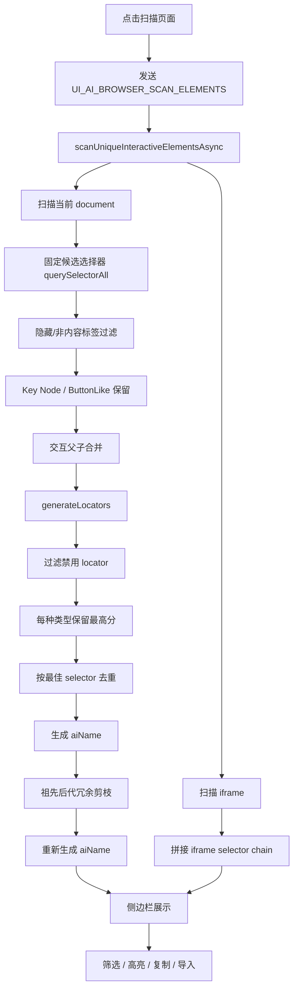

# Chrome 插件批量扫描元素提取与命名规则

> 适用范围：FlowCaptor / UI-AI Chrome 插件侧边栏中的“批量扫描页面元素”。
> 不覆盖：录制事件、单点拾取、回放执行、AI 自愈、Browser Workbench。
> 最后整理：2026-06-05

## 1. 结论

批量扫描不是抓取完整 DOM，也不是把所有可见节点都入库。它的实际流程是：

1. 用固定候选选择器集合收集“可能有自动化价值”的元素。
2. 用 Key Node、ButtonLike、隐藏过滤、交互子节点合并规则做收敛。
3. 对每个候选调用 `generateLocators` 生成定位器。
4. 过滤脆弱定位器，按稳定性评分选择最佳 selector。
5. 生成本地语义名称，并在扫描结果剪枝后重新去重。
6. 侧边栏可选调用 AI 批量命名接口覆盖前 20 个元素的名称。
7. 用户选择后复制 YAML 或导入元素库。

核心代码：

- `apps/extension/src/content/content.ts`
  - `scanUniqueInteractiveElementsAsync`
  - `scanUniqueInteractiveElements`
  - `generateLocators`
  - `buildSemanticElementName`
  - `getUniqueScanElementName`
- `apps/extension/src/content/selector-scoring.ts`
  - `calculateStabilityScore`
  - `getStabilityLevel`
- `apps/extension/src/sidepanel/sidebar/scan-controller.ts`
  - 扫描触发、停止、AI 批量命名、批量导入。
- `apps/extension/src/sidepanel/sidebar/scan-manager.ts`
  - 扫描结果筛选、排序、展示、复制、单个导入。

## 2. 批量扫描流水线



## 3. 候选元素收集规则

批量扫描第一步使用固定 CSS 选择器集合，不主动遍历整棵 DOM。

### 3.1 原生交互元素

```css
button
a[href]
input:not([type="hidden"])
select
textarea
```

### 3.2 交互 role

```css
[role="button"]
[role="link"]
[role="menuitem"]
[role="tab"]
[role="option"]
[role="treeitem"]
[role="listitem"]
[role="row"]
[role="cell"]
[role="gridcell"]
[role="checkbox"]
[role="radio"]
[role="textbox"]
[role="combobox"]
```

### 3.3 显式交互属性

```css
[onclick]
[tabindex]:not([tabindex="-1"])
```

### 3.4 语义和稳定属性

```css
label[for]
img[alt]
[data-testid]
[data-test]
[data-qa]
[data-cy]
[data-automation]
[data-eid]
[data-id]
[data-action]
[data-target]
[data-name]
[dt-eid]
[dt-imp-once]
[dt-params]
[aria-label]
[aria-labelledby]
[name]
[title]
```

### 3.5 class 关键词候选

用于覆盖 React/Vue 等框架中用 `div` / `span` 模拟控件的情况：

```css
[class*="btn"]
[class*="button"]
[class*="tab"]
[class*="link"]
[class*="icon"]
[class*="close"]
[class*="clear"]
[class*="remove"]
[class*="delete"]
[class*="edit"]
[class*="add"]
[class*="create"]
[class*="submit"]
[class*="confirm"]
[class*="cancel"]
[class*="search"]
[class*="filter"]
[class*="sort"]
[class*="toggle"]
[class*="select"]
```

### 3.6 当前候选边界

`cursor:pointer` 在 Key Node 判定中被视为隐式交互，但批量扫描第一步不会全 DOM 遍历 `cursor:pointer`。因此如果一个元素只有 `cursor:pointer`，没有上述 tag、role、onclick、稳定属性或 class 关键词，它可能不会进入批量扫描结果。

## 4. 元素保留规则

候选元素进入结果前，必须通过保留规则。

### 4.1 硬过滤

直接跳过：

- `meta`、`script`、`style`、`link`、`title`、`head`、`noscript`。
- `head` 内元素。
- 强隐藏元素：
  - `display:none`
  - `visibility:hidden`
  - `hidden`
  - `aria-hidden="true"`

当前批量扫描不按视口剔除元素；不在当前 viewport 内但语义稳定的元素仍可能保留。

扫描有 3 秒上限：当已收集超过 5 个元素且超过时间限制，会停止继续处理，避免页面卡死。

### 4.2 Key Node 保留

满足任一条件即认为是 Key Node：

- 原生交互：`button`、`a`、`input`、`textarea`、`select`、`option`。
- 交互 role：`button`、`link`、`tab`、`option`、`menuitem`、`checkbox`、`radio`、`switch`、`slider`、`treeitem`、`listitem`、`row`、`cell`、`gridcell`、`textbox`、`combobox`。
- `tabindex >= 0`。
- 有 `aria-pressed`、`aria-selected`、`aria-expanded`。
- `contenteditable="true"`。
- 有 `onclick`。
- `cursor:pointer`。
- 有 `aria-label`、`aria-labelledby`、`title`、`alt`。
- 自身 DirectText 长度 2 到 16。
- 自身有 2 个以上子元素，或父级有 2 个以上子元素。
- 结构地标：`nav`、`header`、`footer`、`main`、`aside`、`section`、`article`。
- landmark role：`navigation`、`banner`、`contentinfo`、`main`、`complementary`、`region`、`article`。
- 稳定标识：`data-testid`、`data-qa`、`data-id`、`data-track`、`data-test`、`data-cy`、`data-automation`、`data-eid`。
- 视觉关键容器：可滚动容器、`sticky` / `fixed`、`dialog` / `alertdialog`。

### 4.3 ButtonLike 保留

`div` / `span` 如果像按钮，会被保留并按按钮命名。

触发条件：

- class/id token 包含 `button` 或 `btn`。
- class/id token 同时包含 `filter` 和 `button`。
- `role="button"`。

典型例子：

```html
<div class="filter-button__main"><span>30万以上</span></div>
```

期望名称：

```text
filter_30万以上_button
```

### 4.4 交互子节点合并

如果父元素是交互主体，子元素只是文本、图标或装饰，则跳过子元素，保留父元素。

典型场景：

- `button > span`
- `button > i`
- `button > svg`
- `button > img`

如果子元素本身也有独立交互语义，不合并。

### 4.5 祖先后代冗余剪枝

扫描结束后再次清理结果：

- 如果祖先和后代都被扫描到；
- 且祖先包含后代；
- 且文本相同，或后代有有效文本；

则跳过祖先，保留更具体的后代。

剪枝完成后会重新生成元素名称，避免被已删除元素影响命名去重。

## 5. 批量扫描定位器规则

批量扫描复用单元素 `generateLocators`，但会额外过滤不适合批量入库的定位器。

### 5.1 定位器候选来源

候选大致按以下顺序生成：

1. iframe / frame 特殊处理。
2. Shadow DOM / iframe context chain 检测。
3. 测试属性：`data-testid`、`data-test`、`data-qa`、`data-cy`、`data-automation`。
4. 自定义稳定属性：`dt-eid`。
5. 所有有效 `data-*`：跳过空值、过长值、随机值、长数字值。
6. 非动态 `id`。
7. 类型专用定位器：checkbox、radio、select。
8. 唯一 `name`。
9. label 关联。
10. 唯一 placeholder。
11. 唯一 `aria-label`。
12. 稳定祖先相对 CSS / XPath。
13. role + accessible name。
14. `img[alt]`。
15. 唯一 `title`。
16. 短文本定位。
17. 列表/表格定位。
18. 回溯 XPath。
19. Smart XPath。
20. 稳定 class CSS。
21. Context-aware XPath / CSS。

### 5.2 唯一性

定位器会尽量校验为唯一：

- CSS 使用 `querySelectorAll`。
- XPath 使用 `document.evaluate`。
- iframe / Shadow DOM 中使用元素所属上下文。
- context chain 存在时优先按上下文校验。

如果存在唯一定位器，优先保留唯一定位器；否则保留去重后的候选。

### 5.3 禁用定位器

批量扫描会过滤：

- `xpath_fallback`。
- 从 `/html` 或 `/body` 开始的绝对 XPath。
- 不满足相对 XPath 规则的 XPath。
- 深度过深的 XPath。

允许的 XPath 主要是：

```text
//tag[...]
(//tag[...])[n]
```

深度限制为 4 以内。

### 5.4 评分和最佳 selector

评分来自 `calculateStabilityScore`。

稳定性等级：

- `HIGH`：`score >= 80`
- `MEDIUM`：`score >= 60`
- `LOW`：`score < 60`

加分因素：

- `data-test` / `data-qa` / `data-cy`
- 稳定 `name`
- 非动态 `id`
- `role`
- `aria-*`
- `title`
- 语义关键词：`login`、`submit`、`search`、`menu`、`dialog` 等
- 全局唯一或上下文唯一
- 选择器较短

扣分因素：

- `nth-child`、`nth-of-type`、`[n]`
- 纯标签路径
- 路径深度大于 2
- 动态 id / class
- 过长 selector
- 多语言场景下的文本定位

硬截断：

- 动态 id 最高 45 分。
- 动态 class 最高 55 分。

批量扫描展示排序使用 `displayScore`，会叠加类型偏好：

- `role` / `testid` 加 6。
- `name` 加 5。
- `label` / `id` / `css` 加 4。
- `xpath` 加 3。
- `placeholder` 加 2。
- `text` / `xpath_indexed` 加 1。

最终选择：

1. 定位器按 `type:value` 去重。
2. 优先保留唯一候选。
3. 过滤禁用定位器。
4. 计算 `displayScore`。
5. 每种类型只保留最高分。
6. 第一名作为该元素的 `selector`。
7. 同一个最佳 selector 只保留第一个元素。

## 6. 元素命名规则

批量扫描会先在 content script 本地生成 `aiName`，再由侧边栏按条件调用 AI 批量命名覆盖部分结果。

### 6.1 本地命名格式

默认：

```text
base_suffix
```

冲突时：

```text
context__base_suffix
base_suffix_2
base_suffix_h1234
```

最大长度为 35，截断时保护 suffix 完整。

### 6.2 元素分型

命名前先分为三类：

- `Interactive`：原生交互标签、交互 role、`tabindex >= 0`、`onclick`。
- `ButtonLike`：`div` / `span` 但 class/id/role 命中按钮语义。
- `Container`：非交互容器。

### 6.3 suffix 规则

ButtonLike：

- 强制 `button`。

Interactive：

- role 优先。
- 其次 tag + input type。
- 再次 tag。

常见映射：

| 元素/role | suffix |
| --- | --- |
| `button` / `submit` | `button` |
| text/search/email/tel/url/number input | `input` |
| password input | `password` |
| `textarea` | `textarea` |
| `select` | `select` |
| checkbox | `checkbox` |
| radio | `radio` |
| `a` / link | `link` |
| `img` | `img` |
| `li` / listitem | `li` |
| tab | `tab` |
| menuitem | `menuitem` |
| option | `option` |

Container：

| role/tag | suffix |
| --- | --- |
| navigation / nav | `nav` |
| banner / header | `header` |
| contentinfo / footer | `footer` |
| main | `main` |
| complementary / aside | `aside` |
| section | `section` |
| region | `region` |
| 其他 | `div` |

### 6.4 base 候选来源

ButtonLike：

1. 短中文可见文本。
2. AccessibleName。
3. `title`。
4. class/id 中的语义 prefix，例如 `filter`。

Interactive：

1. AccessibleName。
2. `title`。
3. `value`。
4. `placeholder`。
5. 可见文本，允许 descendant text。
6. `name`。
7. 语义 class/id。

Container：

1. 语义 class/id。
2. 地标 role/tag。
3. DirectText，只取自身文本，不继承子孙文本。
4. 稳定 hash。

### 6.5 AccessibleName 顺序

AccessibleName 当前取值顺序：

1. `aria-labelledby`。
2. `aria-label`。
3. 关联 label。
4. `title`。
5. `alt`。
6. `value`。
7. `innerText` / `textContent`。

### 6.6 中文优先

命名规则优先保留中文语义：

- 候选中有中文时，优先选择中文候选。
- 中英文混合时提取中文片段。
- 对 `30万以上`、`100元以下` 这类短文本，保留数字和中文单位，不只提取中文。
- 短中文文本门槛：2 到 16 字，不含换行，非纯符号，可包含数字与单位。
- 会去掉尾部计数，如 `筛选项（12）`。

### 6.7 文本清洗

清洗步骤：

1. 全角转半角。
2. 非中文、英文、数字替换为 `_`。
3. 合并连续 `_`。
4. 去掉首尾 `_`。
5. 相邻 token 去重。
6. 最多保留 3 个 token。
7. 有强语义词时优先保留强语义词。

强语义词示例：

- `搜索` / `search`
- `登录` / `login` / `signin`
- `注册` / `register` / `signup`
- `用户名` / `username`
- `密码` / `password`
- `验证码` / `captcha` / `code`
- `筛选` / `filter`
- `价格` / `price`
- `品牌` / `brand`
- `退出` / `logout`

弱语义词允许使用，但不优先：

- `更多` / `more`
- `关闭` / `close`
- `确认` / `confirm` / `ok`
- `取消` / `cancel`
- `提交` / `submit`
- `保存` / `save`
- `返回` / `back`

### 6.8 class/id token 过滤

动态 token 过滤：

- 框架/样式前缀：`react-`、`mui-`、`ember`、`ng-`、`jss-`、`css-`、`ant-`、`rc-`、`ruyi-`、`icon-`。
- 8 位以上 hex。
- 12 位以上大小写数字混合串。
- 连续 4 位以上数字。

结构/样式噪音过滤：

- `wrapper`、`container`、`inner`、`outer`、`content`、`box`、`group`。
- `flex`、`row`、`col`、`grid`、`inline`、`block`。
- `p-*`、`m-*`、`text-*`、`bg-*`、`border-*`、`rounded-*`、`shadow-*`、`opacity-*`、`z-*`。

### 6.9 命名去重

当前实现的去重顺序：

1. 无冲突：直接使用 `base_suffix`。
2. 对 `menuitem`、`tab`、`option`、`treeitem`，优先追加序号，因为这些角色通常顺序相对稳定。
3. 其他元素优先尝试父级语义 context：`context__base_suffix`。
4. context 不可用或仍冲突时追加序号。
5. 最后使用稳定 hash。

父级 context 来源：

- 最近 5 层祖先的语义 class/id。
- `dialog` / `alertdialog` 的 `aria-labelledby`。
- `dialog` / `alertdialog` 内的 `h1` / `h2`。

### 6.10 AI 批量命名

侧边栏在扫描完成后，如果当前项目已配置 AI 且用户已登录，会调用：

```text
POST /api/v1/ai/elements/batch-name
```

规则：

- 只发送前 20 个扫描元素。
- 输入字段包括：`tagName`、`text`、`selector`、`role`、`ariaLabel`、`placeholder`。
- AI 返回 `aiName` 时覆盖本地名称。
- AI 未配置、未登录或调用失败时，保留本地名称。

## 7. iframe 批量扫描规则

批量扫描会额外处理页面中的 `iframe, frame`。

流程：

1. 扫描当前 document。
2. 找到页面中的 `iframe, frame`。
3. 跳过 `style.display === "none"` 或 `style.visibility === "hidden"` 的 iframe。
4. 先为 iframe 元素生成最佳 selector。
5. 通过 `postMessage({ type: "UI_AI_SCAN_IFRAME_REQUEST" })` 请求 iframe 内扫描。
6. 5 秒超时，超时返回空列表。
7. iframe 内元素返回后拼接 selector chain。

iframe 链格式：

```text
iframe_selector >> internal:control=enter-frame >> child_selector
```

输出字段：

- `isInIframe: true`
- `iframeSelector`
- `originalSelector`

复制 YAML 和导入元素库时都会保留 iframe 上下文。

## 8. 侧边栏结果处理

### 8.1 展示筛选

侧边栏支持：

- 关键词过滤：匹配名称或 selector。
- 类型过滤：`input`、`button`、`select`、`link`、`list`、`checkbox`、`radio`、`text`。
- 最低分过滤。
- 排序：分数降序、分数升序、名称升序、类型升序。

### 8.2 复制格式

普通元素：

```yaml
element_name: selector
```

iframe 元素：

```yaml
element_name: iframe_selector >> internal:control=enter-frame >> child_selector
```

如果 selector 已包含 iframe 链，不重复拼接。

### 8.3 导入元素库

导入前必须选择已有页面。

导入 payload：

```json
{
  "page_name": "页面名称",
  "elements": [
    {
      "name": "login_button",
      "locator_value": "[data-testid=\"login\"]",
      "description": "",
      "iframe_info": null
    }
  ]
}
```

导入前校验：

- 同批次名称不能重复。
- 同批次 locator 不能重复。
- 与目标页面已有元素名称不能重复。
- 与目标页面已有元素 locator 不能重复。

提交接口：

```text
POST /api/v1/elements/import?project_id={projectId}
```

## 9. 当前失败边界

批量扫描当前已知边界：

- 只靠 `cursor:pointer` 的元素可能漏扫。
- 虚拟列表、懒加载元素需要滚动到区域后重新扫描。
- closed Shadow DOM 内部节点不会被批量扫描到。
- 跨域 iframe 如果没有 content script 执行环境，可能无法返回内部元素。
- 动态 id/class 会被降分或过滤。
- 绝对 XPath 被禁用；不要为了命中率恢复完整 DOM 路径。
- 纯文本定位在多语言页面中稳定性较低，应作为 fallback。

## 10. 修改批量扫描规则的验证清单

改动批量扫描时至少确认：

1. 候选选择器是否覆盖目标元素。
2. Key Node / ButtonLike 是否会保留目标元素。
3. 是否避免 `button > span` 这类父子重复入库。
4. `generateLocators` 是否能生成至少一个非禁用定位器。
5. 最高分 selector 是否稳定且唯一。
6. `aiName` 是否符合命名规则，剪枝后是否重新去重。
7. iframe 元素复制和导入时是否保留 selector chain。
8. 导入 payload 是否包含 `name`、`locator_value`、`iframe_info`。

建议验证：

```bash
pnpm --dir apps/extension build:strict
```

发布前执行：

```bash
pnpm --dir apps/extension regression:smoke
```
